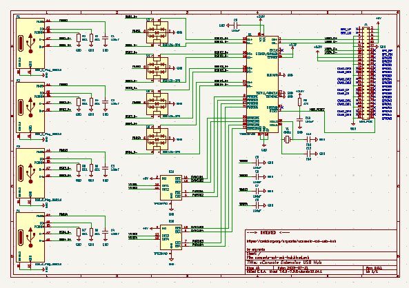
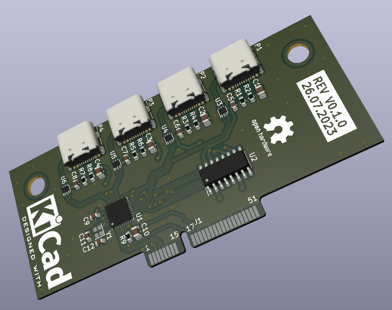
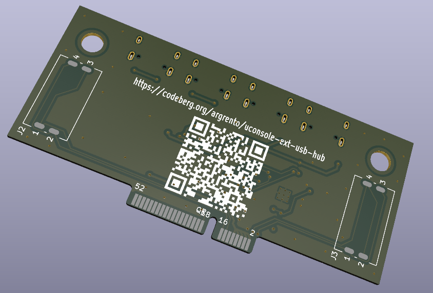

Licence | OSHWA
:-------------------------:|:-------------------------:
 | 

# uConsole USB Hub

This extension board adds 4 additional USB ports to the [uConsole](https://www.clockworkpi.com/uconsole).

## Schematic

## PCB

